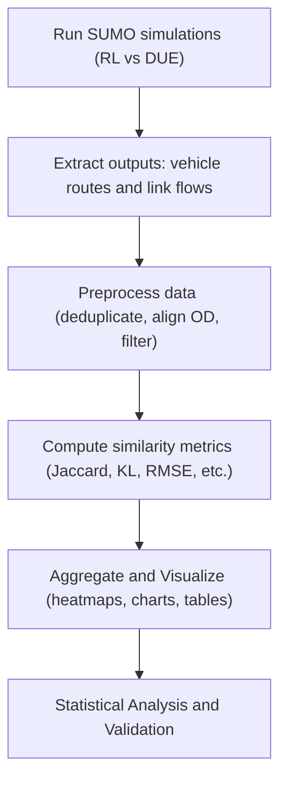

# Quantitative Path-Comparison Metrics for Route-Choice Analysis

**Executive Summary:** To compare route-choice outcomes from reinforcement‐learning (RL) vs dynamic-user-equilibrium (DUE) models, one needs quantitative metrics beyond convergence gaps. We survey candidate metrics for comparing sets of paths (edge sequences), path flows, and travel times. Key measures include *overlap-based indices* (e.g. common edges, Jaccard, Sørensen–Dice, Dial’s Commonality Factor), *sequence-based metrics* (Levenshtein/edit distance), *geometric measures* (Hausdorff and Fréchet distances), *distributional distances* (Kullback–Leibler (KL) divergence, Earth Mover’s Distance (EMD)), and *flow/time differences* (mean travel time difference, link-flow RMSE, path-flow correlation). For each metric we define formulas and key properties (e.g. sensitivity to path length, edge order, partial overlap, direction) and discuss computational complexity, noise robustness, and suitability for SUMO outputs (which provide edge sequences via the <vehroute> output and link flows via edgeData. Practical guidance is given on which metrics suit different goals (set-level vs pairwise vs flow-based comparison), interpretation thresholds, and combining metrics. We outline an experimental design using SUMO: extracting edge sequences and flows, preprocessing (e.g. grouping similar paths), computing metrics, visualizing (e.g. distance matrices, heatmaps) and statistical testing (e.g. KS or permutation tests). Finally, we give pseudocode for computing three recommended metrics (edge-set Jaccard, path-distribution KL divergence, and link-flow RMSE) from SUMO outputs, and a comparison table summarizing metrics by sensitivity, complexity, input required, and use case.  



## Candidate Metrics: Definitions and Properties

We organize metrics into categories. Each metric is defined with formula, key properties, complexity, robustness, and SUMO applicability.

### Overlap-Based Indices (Set Similarity)
- **Edge Overlap Ratio:** The fraction of edges common to two paths. For paths $A,B$ with edge sets, the *overlap* can be $|A\cap B|/\min(|A|,|B|)$.  It ranges 0 (no common edges) to 1 (one path contained in the other).  It is **symmetrical**, ignores edge order, and is sensitive to path length differences (longer paths may have lower overlap for same absolute intersection).  Complexity $O(m+n)$ using hashing.  Robust to small deviations: one extra or missing edge reduces overlap modestly.  Applicable with SUMO if we extract edge lists per path.

- **Jaccard Index:** Defined as 
  \[
    J(A,B) = \frac{|A \cap B|}{|A \cup B|},
  \]
  where $A,B$ are sets of edges for two paths.  $J\in[0,1]$; 1 means identical edge sets, 0 means no shared edges.  Like overlap, Jaccard ignores order and path direction (paths must share edges exactly).  It penalizes partial overlap: losing even one common edge can drop $J$.  Complexity again $O(m+n)$.  Robustness similar to overlap ratio.  Use case: *pairwise route similarity*.  Interpretation: $J>0.8$ implies highly similar routes.  (We report $1-J$ as a distance if needed.)

- **Sørensen–Dice Coefficient:** Given edge sets $A,B$, 
  \[
    S = \frac{2|A \cap B|}{|A|+|B|}.
  \]
  It ranges 0 to 1.  Equivalent to $S=2J/(1+J)$ (from Jaccard).  Shares properties with Jaccard: symmetric, orderless, sensitive to partial overlap.  Some use prefer Dice for imbalanced sizes (it counts common edges twice in numerator) – often yields slightly higher similarity than Jaccard for the same overlap.  Complexity $O(m+n)$, suitable for edge lists.

- **Commonality Factor (CF):** Originally from the C-Logit route choice model (Cascetta et al. 1996) to penalize overlapping alternatives.  For path $k$ among a choice set $K$, CF is calculated by summing contributions of overlap with every other path $l\in K$:
  \[
  CF_k = \sum_{l\in K} \Bigl(\frac{L_{kl}}{L_kL_l}\Bigr)^\gamma,
  \]
  where $L_{kl}$ is length (or cost) of common links, $L_k,L_l$ path lengths, and $\gamma>0$ (often 1).  CF$_k$ increases with shared length; normalized so CF$\in[0,1]$ roughly (0 no overlap, 1 identical).  CF is *set-based* (requires entire path set) and used in choice modeling.  It **ignores order but includes magnitude of overlap** via common length.  Complexity $O(|K|^2)$ if naively computing overlaps between all pairs of $|K|$ paths; in practice cost of all pairs if $K$ is small (path choice set).  Robustness: sensitive to even small common segments (they add to CF).  Suitable when paths are weighted by length; use if you have complete list of alternative routes.  

- **Path-Size (PS) Factor:** Another logit correction, defined as 
  \[
    PS_k = \sum_{a\in k} \frac{L_a}{L_k\,n_a},
  \]
  where $L_a$ is length of link $a$, $L_k$ total path length, and $n_a$ the number of paths containing $a$.  This sums each link’s *share* across paths.  $PS_k\in(0,1]$, with larger values for more unique routes.  It is symmetric, order-independent, and penalizes sharing.  (Briefly discussed in choice literature【47†L25-L33】.)  Implementation needs counting paths per link.  Complexity $O(\sum_k |k|)$ to compute $n_a$ for all edges.

### Sequence-Based Metrics
- **Edit/Levenshtein Distance:** Treat each path as a sequence of edge IDs. The Levenshtein distance $d_{Lev}(A,B)$ is the minimum number of single-edge insertions, deletions or substitutions to transform sequence $A$ into $B$.  If edges are distinct tokens, $d_{Lev}$ accounts for *order* and *direction* (since reversing order yields a different sequence and larger distance).  Normalized versions divide by max length.  Complexity $O(m n)$ (DP matrix of lengths $m,n$).  Sensitive to path length and order: one mismatched edge in long paths yields distance 1 (small relative).  Robustness: moderate; one extra loop in a path adds 1.  Suitability: use for *pairwise similarity of specific routes*.  Note: must handle directed edge sequences exactly as given by SUMO (edge IDs).  

- **Longest Common Subsequence (LCS):** (Related to edit) The length of the longest subsequence common to both paths.  Can define a distance $d_{LCS}=1 - |LCS|/\min(|A|,|B|)$.  Complexity also $O(mn)$.  Sensitive to order (subsequence respects order, but may skip elements).  Like edit, it requires exact matching of edges; robust to small interruptions (skips over).  (Not detailed here, but another option.)

### Geometric (Trajectory-Based) Metrics
These assume each path is a geometric curve (sequence of coordinates) rather than just abstract edges. If SUMO edge geometry (latitude/longitude or local coords) is known, one can apply:

- **Hausdorff Distance:** Treat each path as a point-set in space (e.g. a polyline of sampled points along edges). The Hausdorff distance $d_H(A,B)$ is the maximum distance from any point on $A$ to the nearest point on $B$ (and vice versa).  Informally, “the longest nearest-neighbor distance” between the curves.  It is a true metric (symmetric, satisfies triangle inequality).  It **ignores sequencing** beyond geometry, and is sensitive to outliers: one remote detour yields large $d_H$.  Complexity is $O(n_A n_B)$ to compute all pair distances, or $O(n_A \log n_B + n_B \log n_A)$ with KD-tree optimizations.  Robustness: *not robust* to small deviating segments (one stray link causes distance spike).  Suitable for comparing actual trajectories (e.g. cycling/walking paths).  For SUMO, one could sample edge midpoints or geometry points of each path.  Note: because edges are directed, if you reverse a path, Hausdorff might remain small if geometry overlap (it’s undirected set distance), but [35] shows average Hausdorff is insensitive to reversal while Fréchet isn’t.

- **Fréchet Distance:** A metric of curve similarity that respects the order of traversal.  Intuitively (dog-walk metaphor), it is the minimum leash length needed so a person and dog can walk along the two paths without backtracking.  Formally, it is 
  \[
    F(A,B) = \inf_{\alpha,\beta} \max_{t\in[0,1]} d\bigl(A(\alpha(t)),B(\beta(t))\bigr),
  \]
  optimizing reparameterizations $\alpha,\beta$.  Fréchet is symmetric and sensitive to **geometry, ordering and direction**: reversing a path can dramatically increase $F$.  It is more robust to outliers than Hausdorff, since it looks at continuous matching.  Complexity for discrete Fréchet is $O(mn)$ with DP, but can be high in practice.  Robustness: moderate; a detour increases distance but local deviations may be accommodated by reparameterization.  Suitable when comparing physical trajectories.  SUMO: use edge center coordinates or nodes to form point curves.

### Distributional Metrics (Set-Level Differences)
These compare two *distributions* of paths or flows rather than individual paths.

- **Kullback–Leibler Divergence (KL):** Given two probability distributions $P$ and $Q$ over paths (or links), 
  \[
    D_{KL}(P\parallel Q) = \sum_i P(i)\,\ln\frac{P(i)}{Q(i)}.
  \]
  It measures the “information gain” from $Q$ to $P$.  $D_{KL}\ge 0$, zero iff $P=Q$.  Asymmetric ($D_{KL}(P||Q)\neq D_{KL}(Q||P)$).  It is **highly sensitive to small probabilities**: if $Q(i)=0$ for a path with $P(i)>0$, $D_{KL}$ is infinite (requires smoothing).  Complexity $O(K)$ for $K$ support points (paths or links).  Robustness: *not robust* to zero-prob events; small probability discrepancies have large effect.  Suitable for *global distributional comparison* of route-choice probabilities or link flows (by treating each path or link as an event).  In SUMO, one can derive a distribution of path frequencies (normalized counts) or of link flows and compute KL.  

- **Earth Mover’s Distance (EMD) / Wasserstein Metric:** Interprets two distributions (e.g. path-flow histograms) as piles of “earth” and computes the minimum cost to transform one into the other【50†L125-L132】.  Cost is mass times ground distance between bins.  Formally the Wasserstein-$1$ distance.  Unlike KL, EMD is a true metric and can handle partial mismatches gracefully.  Complexity: solving an optimal transport (network flow) problem, typically $O(K^3)$ or using approximations.  Sensitivity: robust to small discrepancies because it accounts for how far probability mass moves.  Requires a distance matrix between elements: e.g. define distance between paths (could use Jaccard or geometric distance as ground cost)【50†L125-L132】.  Suitable for distributions where “nearby” mismatches are less severe.  For SUMO, EMD could compare path-flow distributions with ground distance defined by, e.g. Jaccard or Hausdorff between paths, or compare link-flow distributions with link-distance.

### Flow and Time Differences
- **Mean Path Travel Time Difference:** Compute average travel time over all trips for each scenario (or each path) and compare (difference of means or KS distance between time distributions).  Simple metric (e.g. $|\overline{T}_{RL}-\overline{T}_{DUE}|$ or distributional tests).  Sensitive to global travel time changes; ignores route geometry.  Complexity trivial.  Suitable to capture overall performance change.

- **Link-Flow RMSE:** If $f_i,f'_i$ are flows (vehicles per interval or per hour) on each link $i$ under RL vs DUE, compute 
  \[
    \text{RMSE} = \sqrt{\frac{1}{N}\sum_{i=1}^N (f_i - f'_i)^2}.
  \]
  This measures aggregate difference in network usage.  Scale-dependent (large networks give larger RMSE); can be normalized by average flow.  Complexity $O(N_{\rm links})$.  Robustness: emphasizes large errors (squared term).  Suitable for *network-level flow comparison*.  SUMO provides edge flows in edgeData output (attribute `flow`, see【61†L109-L113】).  

- **Path-Flow Correlation:** If corresponding paths can be matched, one can compute Pearson or Spearman correlation between the vector of path flows under RL and DUE.  Complexity $O(K)$ for $K$ paths.  Sensitive to ordering: paths need one-to-one matching (identity check by exact edge sequence).  Robust to scale if normalized.  Useful to see if overall pattern is linear.  

- **Network-Based Metrics:** These include any graph-theoretic comparison of flow patterns. Examples: difference in network travel time (sum of link travel times), changes in node/edge centralities, or similarity of shortest-path trees.  These tend to be complex and situation-specific, so we focus on the above core metrics.  

Each metric’s suitability depends on the data: edge-based (Jaccard, edit, flows) vs geometry-based (Hausdorff, Fréchet require coordinates).  Most sequence/set metrics (Jaccard, Dice, CF, edit) require extracting each trip’s edge sequence (SUMO’s `<vehroute>` output【62†L51-L54】). Distribution metrics (KL, EMD) need aggregated path frequency or link-flow distributions (from tripinfo or edgeData). Flow/time metrics use link flow or travel-time outputs (SUMO’s edgeData or tripinfo**).  

## Practical Guidance: Choosing and Interpreting Metrics

- **Comparison Goals:** 
  - *Pairwise Route Similarity* (comparing specific routes): use Jaccard/Dice (for overlap), Levenshtein (sequence similarity), Hausdorff/Fréchet (geometric similarity). 
  - *Set-Level Distribution* (comparing overall route-choice behavior): use KL divergence or EMD on path distributions, and statistical tests (e.g. chi-square, KS) on travel-time distributions or path-use frequencies. 
  - *Flow-Based Comparison* (network performance): use link-flow RMSE and path-flow correlation to compare global patterns, and mean travel time differences. 
  Combining metrics is recommended: e.g. a low flow-RMSE but high path-Dice would indicate similar flows but different routes.  
- **Thresholds/Interpretation:** There are no universal cutoffs, but for intuition: Jaccard/Dice >0.8 indicates routes are largely overlapping; KL divergences near 0 indicate similar distributions; RMSE normalized by average flow (NRMSE) <0.1 might be considered a close match. Interpret metrics relative to scenario scale.  
- **Combining Metrics:** One can form a vector of metrics (e.g. [Jaccard, Hausdorff, flow RMSE]) to capture different aspects. Multivariate methods (PCA, clustering) can summarize them. Reporting a suite of metrics (table or multi-chart) is recommended for a holistic picture.  

## Experimental Design with SUMO

1. **Data Extraction:** Run simulations for RL and DUE scenarios. Use SUMO’s `--vehroute-output` option to log each vehicle’s route (edge sequence), and use an edge-based detector (e.g. `<edgeData>` or `--edgedata-output`) to record link flows and speeds. Also enable tripinfo output for travel times.  
2. **Preprocessing:** 
   - *Group paths by OD pair:* RL vs DUE may generate different paths for same OD. Align paths by OD for fair comparison. 
   - *Deduplicate/label similar paths:* Decide if two slightly different routes count as same alternative or not. One could cluster paths by, say, Jaccard > 0.9 and treat as equivalent. Otherwise treat exact edge-list as identity.  
   - *Sampling:* If datasets are large (many vehicles), one might sample vehicles or aggregate flows. For path-distribution metrics, count frequencies rather than raw trajectories.  
3. **Metric Computation:** Compute chosen metrics on aligned data. For pairwise metrics (Jaccard, Hausdorff, etc.), one might compare each RL path to its “closest” DUE path (min distance) and summarize (mean or worst-case). For distribution metrics, build normalized histograms over unique paths or links.  
4. **Statistical Analysis:** Use paired tests to assess differences. For continuous metrics (e.g. travel time), use t-test or KS-test. For vector metrics (flow patterns), use permutation tests on RMSE or correlation. Confidence intervals on metrics (via bootstrapping vehicles) help assess significance.  
5. **Visualization:** 
   - *Heatmaps:* e.g. a matrix of pairwise Jaccard (or Hausdorff) distances between top-`k` paths of RL and DUE (as in a distance matrix heatmap). 
   - *Histograms/Boxplots:* compare distributions of path lengths or travel times. 
   - *Bar charts or scatter:* of link flows (vector scatter plot) or path flows. 
   - *Tables:* summarizing metrics (mean±std) for each scenario.  
6. **Validation Experiments:** To test metrics’ discriminative power, create synthetic modifications. For example, take a base route set and introduce controlled changes (e.g. swap one link on 10% of paths, add random noise to flows) and ensure metrics reflect the change. Alternatively, compare two known different flows (e.g. high-demand vs low-demand scenarios) to see if metrics rank them appropriately. Validate that metrics align with intuitive differences.

## Implementation: Example Pseudocode

Below are high-level steps to compute three recommended metrics (edge-set Jaccard, KL divergence on path usage, and link-flow RMSE) using SUMO outputs. Assume we have two scenarios **A** (e.g. DUE) and **B** (e.g. RL).

```python
# (1) Extract data from SUMO outputs
#   - VehRoutes: map each vehicle to its path (list of edges)
#   - EdgeData: get flow on each link

# Pseudocode:
load VehRoutes output for A and B
pathsA = list of edge-sequences for all vehicles in A
pathsB = list of edge-sequences for all vehicles in B

# (2) Build path frequency distributions
# Use tuple of edges as key
from collections import Counter
distA = Counter(tuple(path) for path in pathsA)
distB = Counter(tuple(path) for path in pathsB)

# Normalize to get probabilities
totalA = sum(distA.values()); totalB = sum(distB.values())
P = {path: count/totalA for path, count in distA.items()}
Q = {path: count/totalB for path, count in distB.items()}
# Ensure support is same for KL: add zero for missing
all_paths = set(P) | set(Q)
for path in all_paths:
    P.setdefault(path, 0)
    Q.setdefault(path, 0)

# (3) Compute Jaccard (edge overlap) on representative paths
# For simplicity, pick most frequent paths or compute average overlap
def jaccard(setA, setB): 
    return len(setA & setB) / len(setA | setB) if setA|setB else 1.0

# E.g. compare top-5 paths of A vs B:
topA = [p for p,_ in distA.most_common(5)]
topB = [p for p,_ in distB.most_common(5)]
J_matrix = {}
for p in topA:
    for q in topB:
        J_matrix[(p,q)] = jaccard(set(p), set(q))
# Report e.g. max, mean Jaccard among best matches.

# (4) Compute KL divergence on path distributions
import math
KL = 0
for path in all_paths:
    if P[path]>0 and Q[path]>0:
        KL += P[path] * math.log(P[path]/Q[path])
    # (if Q[path]==0 and P[path]>0, KL is infinite; can add smoothing)
print("D_KL(P||Q) =", KL)

# (5) Compute link-flow RMSE
#   Parse edgeData or detectors for link flows (vehicle counts) in A and B
flowA = {edge_id: flow_value from edgeDataA}
flowB = {edge_id: flow_value from edgeDataB}
# Align edges present in both, missing as 0
all_edges = set(flowA)|set(flowB)
sum_sq = 0
for e in all_edges:
    fA = flowA.get(e, 0)
    fB = flowB.get(e, 0)
    sum_sq += (fA - fB)**2
RMSE = (sum_sq / len(all_edges))**0.5
print("Link-flow RMSE =", RMSE)
```

This outlines the approach: parse SUMO outputs, align paths/links, then apply formulas. In practice one would add error-handling (e.g. smoothing for KL).  

## Comparison of Metrics

| **Metric**              | **Sensitivity**                                                | **Complexity**             | **Input Required**         | **Use Case**                                  |
|-------------------------|---------------------------------------------------------------|----------------------------|----------------------------|-----------------------------------------------|
| *Edge Overlap Ratio*    | High if many edges differ; insensitive to order; length bias  | $O(n+m)$ per comparison    | Edge-set (seq) of two paths | Pairwise route similarity                     |
| *Jaccard Index*【37†L184-L192】 | Like overlap ratio; penalises partial overlap; orderless      | $O(n+m)$                   | Edge-set of two paths       | Pairwise route similarity (normalized overlap)|
| *Dice Coefficient*【41†L159-L166】   | Similar to Jaccard; slightly higher for imbalanced lengths    | $O(n+m)$                   | Edge-set of two paths       | Pairwise route similarity                     |
| *Commonality Factor*【65†L1191-L1196】 | Increases with shared length; ignores order; global to set    | $O(K^2)$ (all path pairs)  | All path lengths/overlaps   | Route-choice model correction                 |
| *Path-Size Factor*【47†L25-L33】   | Measures uniqueness of route (≤1); ignores order, link-heavy | $O(\sum_k|k|)$             | All paths and link counts   | Route-choice model correction                 |
| *Levenshtein (Edit)*【43†L172-L177】 | Sensitive to order and length; small diff → small distance    | $O(mn)$ for lengths $m,n$  | Ordered edge sequences      | Pairwise route similarity (sequenced paths)   |
| *Longest Common Subseq.* | Respects order; insensitive to isolated differences           | $O(mn)$                    | Ordered edge sequences      | Pairwise path similarity (sequence)          |
| *Hausdorff Distance*【30†L60-L64】 | Sensitive to spatial outliers; ignores traversal order        | $O(n_A n_B)$ (brute-force) | Geometric points of paths   | Geometric path similarity (worst-case)        |
| *Fréchet Distance*【64†L123-L130】【35†L414-L416】 | Captures shape & direction; sensitive to order, path reversal【35†L414-L416】 | $O(mn\log mn)$ approx. (DP) | Geometric curves (ordered points) | Geometric path similarity (shape)           |
| *KL Divergence*【52†L323-L331】 | High sensitivity to small-prob differences; asymmetric        | $O(K)$ (number of paths)   | Path or link probability distributions | Distributional difference of route usage     |
| *Earth Mover’s Dist.*【50†L125-L132】| Lower sensitivity; accounts for “distance” between elements   | $O(K^3)$ or solver time    | Distributions + ground distance | Distributional comparison with geometry     |
| *Mean Time Difference* | Sensitive to average shifts; ignores which paths changed       | $O(1)$ or $O(N)$           | Travel-time stats per path  | Overall travel-time performance difference    |
| *Link-Flow RMSE*【61†L109-L113】    | Emphasises large flow errors; network-level                 | $O(E)$ (links)             | Link flows for all edges    | Comparing overall network flows               |
| *Path-Flow Corr.*      | Relies on path matching; linear relation measure               | $O(K)$ (paths)            | Flows per path             | Comparing path flow patterns                  |

*Sensitivity* denotes how metric reacts to path length, overlap, order, and outliers. *Complexity* is approximate (where $m,n$ are path lengths, $K$ number of paths, $E$ number of edges). *Input* distinguishes whether metric uses raw edge sequences, geometric data, or aggregated flows. 

## References

Relevant definitions and use of these metrics are documented in the transportation and data-analysis literature. For example, the Hausdorff distance definition is given as “the longest distance from a point in one set to the closest point in the other”【30†L60-L64】. Fréchet distance is defined as a similarity measure “taking into account the ordering of points along curves”【64†L123-L130】 and is directional【35†L414-L416】. The Jaccard index and Dice coefficient measure set overlap【37†L184-L192】【41†L159-L166】. Commonality and path-size factors come from route-choice models【65†L1191-L1196】【47†L25-L33】. Distributional measures like KL and EMD are standard in information theory【52†L323-L331】【50†L125-L132】. SUMO’s `--vehroute-output` provides the actual edge sequences【62†L51-L54】, and SUMO’s edgeData output gives link flows【61†L109-L113】, enabling implementation of the above metrics. 

