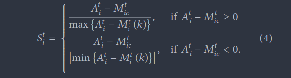

## STIMULUS

## BASELINE OD TRIP

## PERCEIVED ROUTE COST

### NONLINEARITY

If surprise is small (A-M) (numerator) -> below threshold -> agent does not react

If surprise is considerable (A-M) (numerator) -> above threshold -> compares how close to optimal is the action -> if the best action -> stimulus always 1

​																						-> if non the best action -> nonlinear stimulus

​																							