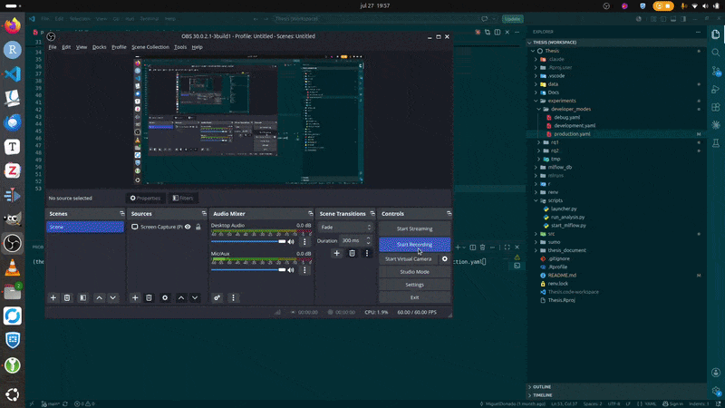
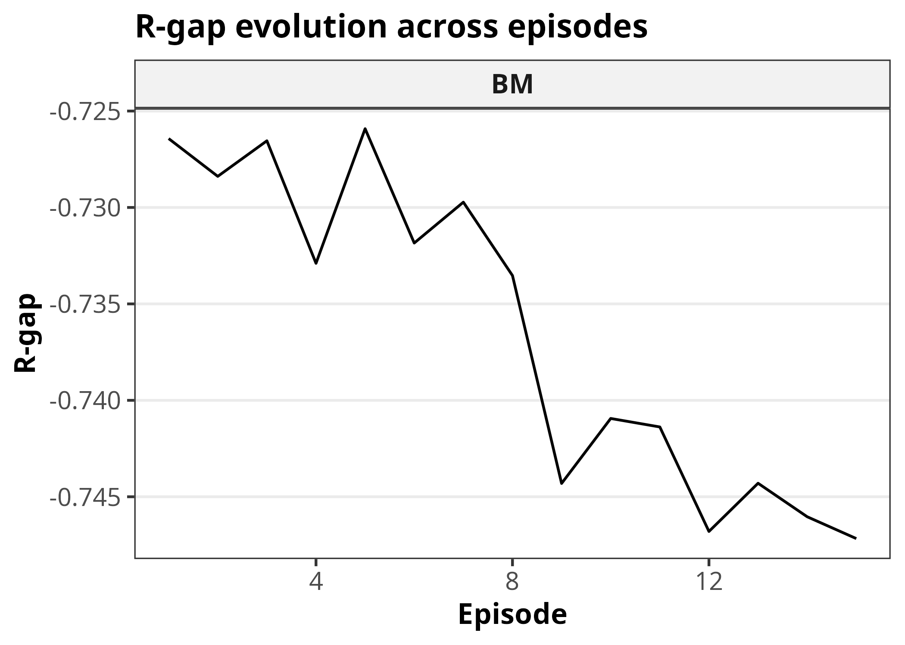
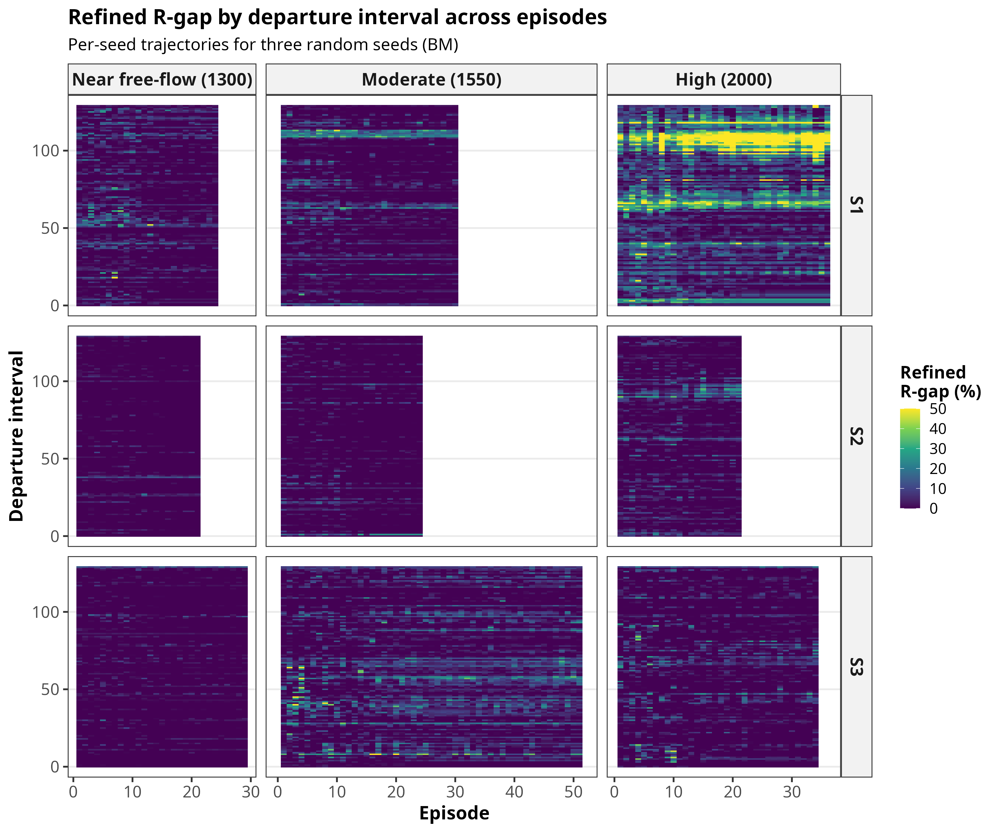
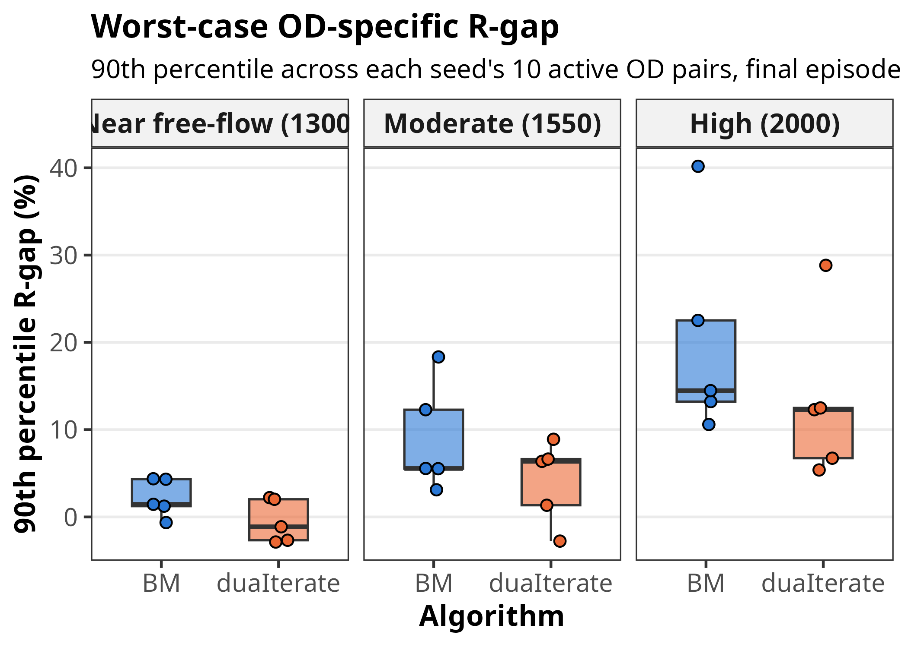

# Day-to-Day Route Choice with Multi-Agent Reinforcement Learning

**Research thesis** — Universidad Politécnica de Catalunya (UPC) · 2026

Most traffic models assume drivers act rationally — choosing routes that minimise
travel cost given full knowledge of network conditions. Decades of cognitive science
research show otherwise: human decisions are systematically biased, heuristic, and
frequently suboptimal.

This project bridges traffic simulation and cognitive modeling in two phases. The
first phase trains rational route-choice agents using Reinforcement Learning inside
SUMO (Simulation of Urban MObility), an open-source microscopic traffic simulator,
and validates their collective behavior against Dynamic User Equilibrium (DUE) — the
theoretical outcome of perfectly rational route choice. The second phase introduces
cognitively inspired agents whose decisions emerge from a mixture of subsystems: one
reflecting the rational agent, others implementing known human heuristics grounded in
cognitive science.

This offers a novel framework for modeling urban mobility grounded in realistic human
behavior, with applications in traffic forecasting, infrastructure planning, and
behavioral intervention design.

**Current status:** Phase 1 is under active development — the rational agent
(Bush-Mosteller RL) and DUE convergence pipeline are implemented and being evaluated.

---

## Demo

A short walkthrough of the pipeline in action:



---

## Research Scope

The thesis investigates multiple research directions around day-to-day route choice
learning. The questions are grouped into the following themes:

| Theme | Description |
|---|---|
| DUE convergence | Can RL agents collectively reach a DUE? How do hyperparameters affect convergence speed and stability? |
| Behavioral extensions | Nonlinear update rules, travel-time variability as perceived cost |
| Heterogeneous agents | Mixed populations with different memory decay rates |
| Congestion regimes | Learning dynamics under light, moderate, and heavy congestion |
| Path & congestion comparison | Do BM and duaIterate produce similar routes and congestion patterns? |
| Traffic scenarios | Recovery from temporary link-capacity degradation |

---

## Results

**RQ1:** Does Bush-Mosteller multi-agent RL converge to a Dynamic User
Equilibrium (DUE) in a microscopic SUMO traffic simulation? Convergence is
measured via three R-gap variants — aggregate, by departure interval, and
by OD pair — computed by the `DUE_convergence` pipeline (TDSP-based), and
compared against `duaIterate`, SUMO's built-in DUE solver, as a baseline.
Full analysis: [`r/RQ1/RQ1.qmd`](r/RQ1/RQ1.qmd).

<p>



</p>

---

## Technical Highlights

- **Multi-agent RL system:** N Bush-Mosteller agents independently learn
  route-choice probabilities from daily travel time observations, with no
  centralised coordination.
- **Congestion-metric sensitivity tools:** Measure the free-flow-normalised
  congestion ratio produced by a given demand level, used to sweep
  hyperparameters (agent count, warm-up time, etc.) against realistic
  congestion regimes.
- **No-TraCI architecture:** Routes are written as XML files each episode
  rather than injected via socket — significantly faster for episodic
  day-to-day learning where routes cannot change mid-episode.
- **R-gap convergence verification:** Relative gap computed via time-dependent
  shortest paths (TDSP), measured at both aggregate and OD-pair level.
- **Experiment tracking:** MLflow logs all hyperparameters, training metrics,
  and analysis artifacts. Simulation and analysis runs are linked via
  `source_run_id` for full reproducibility.
- **Grid-search launcher:** YAML-driven parameter sweep runner that generates
  all combinations, writes temp configs, runs the simulation, and optionally
  triggers the R analysis after each run.

---

## Tech Stack

| Layer | Tools |
|---|---|
| Traffic simulation | SUMO (Simulation of Urban MObility) |
| Reinforcement learning | Python · NumPy |
| Experiment tracking | MLflow (SQLite backend) |
| Data storage | Apache Parquet (PyArrow / R arrow) |
| Analysis & visualisation | R · tidyverse · Quarto |
| Configuration | YAML |

---

## Networks

| Network | Description |
|---|---|
| **Sioux Falls** | Standard transportation research benchmark — 24 nodes, 76 directed edges, no traffic lights, uniform free-flow speed. Used for all main experiments. |
| **Toy network** | Small synthetic network used for initial development and validation of the pipeline. |

---

## Architecture

```
src/
├── main.py                      # Training loop orchestrator (generate agents → train → MLflow → GUI replay)
├── experiment.py                # Per-episode data collection + end-of-run persistence to Parquet
├── agents/
│   ├── agent.py                 # BMAgent — ET, PT, stimulus, probability update
│   └── factory.py               # Batch init / select / update over agent fleet
├── simulation/
│   ├── scenario.py              # OD pairs, k routes via duarouter, SUMO config files
│   └── environment.py           # SUMO subprocess wrapper (file-based, no TraCI)
├── stopping_rule/               # L1 norm policy-change convergence check (post-warm-up agents only)
├── DUE_convergence/             # R-gap, TDSP, duaIterate benchmark pipeline
├── parsing/                     # XPath-driven SUMO XML parsers → Parquet
├── analysis/                    # SUMO-GUI edge-colour comparison of BM vs duaIterate
├── mlflow_tracking/             # MLflow logging for simulation and analysis runs
├── utils/                       # Agent/demand generation, free-flow TT, network stat helpers
├── tools/                       # One-off network prep tools + sensitivity/ parameter sweeps
└── config/
    ├── config.py                # Config dataclass (hyperparameter groups) + RunMode
    ├── config.yaml              # XPath selectors for SUMO XML parsing
    └── paths.py                 # All paths derived from BASE_DIR
scripts/
├── launcher.py                  # Grid-search launcher (YAML design → combinations)
├── run_analysis.py              # Quarto render + MLflow analysis run logging
└── start_mlflow.py              # MLflow UI pointed at project SQLite backend
experiments/
├── rq1/                         # RQ1 configs: base.yaml + grid-search design.yaml
├── rq2/                         # RQ2 configs
└── developer_modes/             # debug / development / production config presets
r/
├── RQ1/RQ1.qmd                  # Quarto report: R-gap convergence analysis
└── shared/theme.R               # Shared ggplot2 theme for thesis figures
```

---

## Future Work

**Phase 2 — Cognitive modeling:**
Introduce agents whose route choices emerge from a mixture of decision-making
subsystems. The rational subsystem will be the RL agent developed in Phase 1;
additional subsystems will implement human heuristics from cognitive science.

**Planned RL algorithms (Phase 1 extensions):**
- Thompson Sampling — Bayesian exploration as an alternative to BM's stimulus-based
  update; also a natural fit as a probabilistic cognitive subsystem in Phase 2
- Q-learning / modern RL — comparison against classical BM in the same environment

**Planned research themes:** behavioral extensions to BM, sensitivity analysis
(learning rate, memory level), heterogeneous agent populations, congestion regime
analysis, traffic scenario resilience.

**Deployment (planned):** Dockerize the full environment — SUMO, Python, R, and
MLflow — so experiments are reproducible without manual dependency setup across
machines.

---

## Reference

Wei, F., Ma, S., & Jia, N. (2014). A Day-to-Day Route Choice Model Based on
Reinforcement Learning. *Mathematical Problems in Engineering*, 2014, 646548.
https://doi.org/10.1155/2014/646548

María Paz Linares Herreros and Jaime Barceló Bugeda, 
‘A Mesoscopic Traffic Simulation Based Dynamic Traffic Assignment’ 
(Universitat Politècnica de Catalunya, 2014), 
https://doi.org/10.5821/dissertation-2117-95313.